# AutoProm AI — Платформа автоматизации управления требованиями на базе ИИ

Перерасходование бюджета до 100х в промышленной разработке в 64% случаев вызвано ошибками на стадии проектирования. Об этом говорят как отраслевые исследования, так и практика крупных инженерных компаний.

Даже небольшая ошибка в требованиях может привести к серьёзным последствиям. Например, некорректная интерпретация требований к отображению информации способна затронуть безопасность продукта и привести к дорогостоящим исправлениям после выпуска.

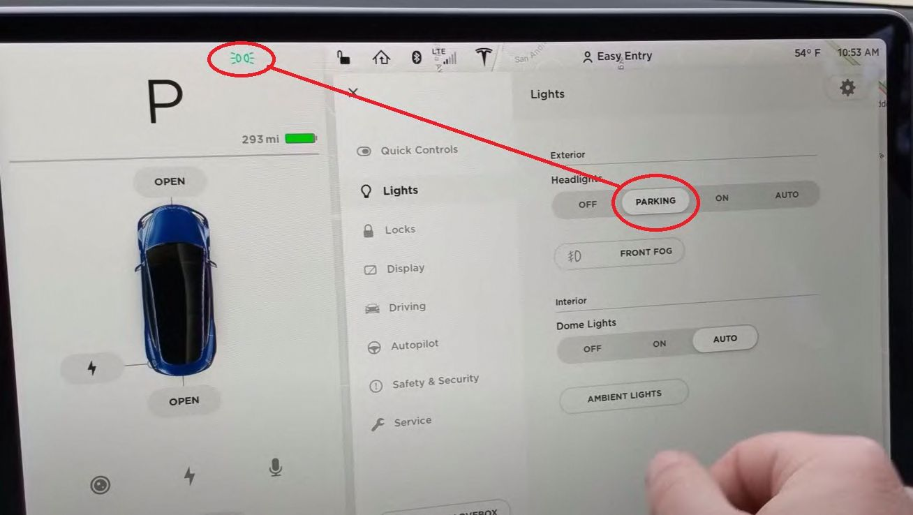

*Пример того, как ошибки в спецификациях и трактовке требований могут проявляться в конечном продукте.*

Поэтому для разработки в высокорегламентированных отраслях, таких как автомобилестроение, авиастроение и других, используется специализированный софт для управления требованиями. Компании вроде Airbus, Ferrari и большинство крупных промышленных предприятий применяют решения типа IBM DOORS, Jama Connect и их аналоги.

Однако в последние годы цифровая трансформация существенно меняет процессы внутри корпораций. Если раньше стандартом была V-модель, то в эпоху цифровых сервисов она уже не работает. Программные решения требуют большей гибкости и разных интерпретаций Agile-подходов.

ИТ-отделы заметно выросли, а в некоторых компаниях стали основными. Например, директор автопроизводителя Nio отмечал, что ИТ-блок составляет 60% компании, а традиционный инженерный — только 40%. Новые игроки изначально строят работу вокруг software-defined подхода.

В результате решения по управлению требованиями, которым по несколько десятилетий, постепенно уступают место новым инструментам. Компании, которые развивают цифровые сервисы, стараются сразу использовать эффективные инструменты для проектирования. Раньше приборную панель достаточно было сертифицировать один раз. Сейчас, с регулярными обновлениями ПО, нужны решения, которые позволяют делать это быстро и без больших затрат времени.

## Масштаб проблемы

64% дефектов ПО возникают на этапах анализа требований и проектирования. Исправление таких дефектов на поздних стадиях обходится в среднем в 100 раз дороже. В автопроме цена одной ошибки в требованиях редко бывает ниже 1 млн рублей. При этом 49% требований отклоняются на ревью по формальным причинам — неполнота, неоднозначность, противоречивость или дублирование. Одно полноценное ревью может занимать до 5 дней.

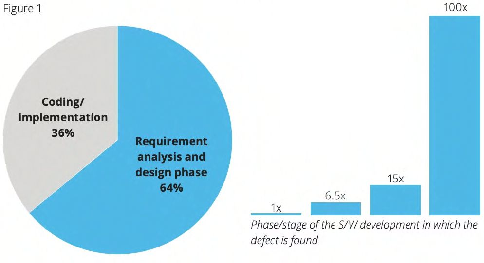

*Большая часть дорогостоящих дефектов возникает ещё до начала реализации. Чем позже обнаружена ошибка, тем выше стоимость её исправления.*

Классические примеры последствий хорошо известны.

### Mars Climate Orbiter

NASA потеряла космический аппарат Mars Climate Orbiter стоимостью 125 млн долларов из-за несогласованности единиц измерения между различными командами проекта.

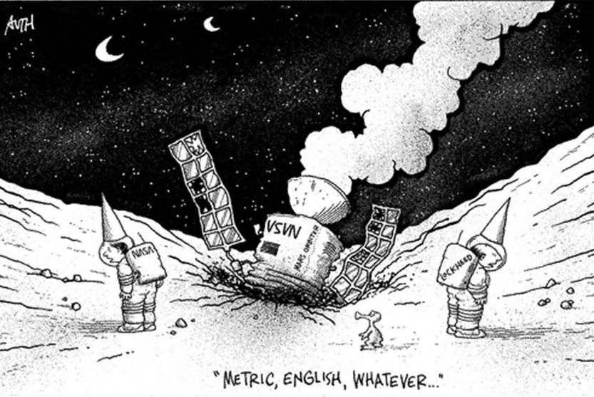

*Один из самых известных примеров последствий несогласованных требований и интерфейсов между командами.*

### Knight Capital Group

В 2012 году Knight Capital Group потеряла около 440 млн долларов менее чем за час после запуска обновления торговой платформы, содержавшего критическую ошибку.

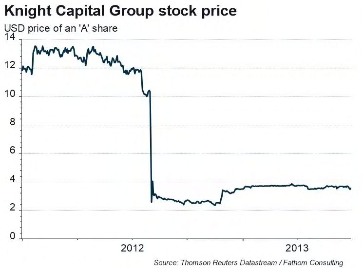

*Ошибки в процессах изменений и спецификациях способны приводить к мгновенным финансовым потерям.*

## Состояние рынка

Глобальный рынок инструментов управления требованиями в 2024 году оценивался в 1,32 млрд долларов с прогнозируемым CAGR 9,54% до 2033 года. В России объём рынка ALM/RM-систем составил 13,6 млрд рублей в 2024 году при ожидаемом росте 17% до 2033 года.

Большинство существующих решений (как зарубежных, так и российских — Devprom ALM, УправТреб, MIRaR и др.) либо вообще не используют ИИ, либо применяют его в ограниченном объёме.

### Международные решения

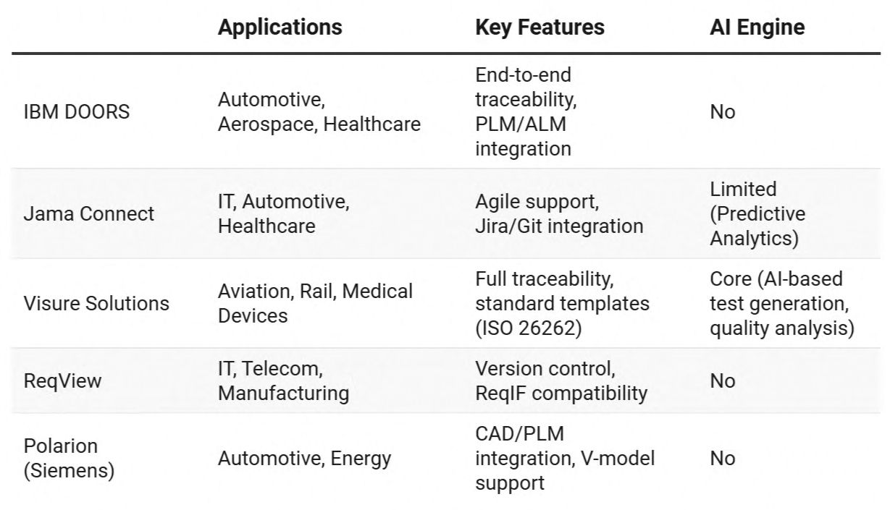

*Сравнение ведущих мировых решений для управления требованиями.*

### Российские решения

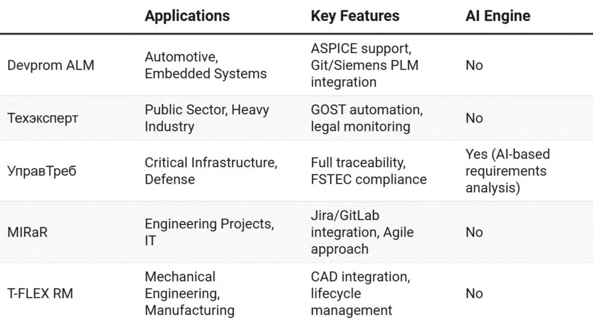

*Обзор основных отечественных платформ управления требованиями.*

Для примера ниже показан интерфейс одной из популярных российских ALM/RM-систем.

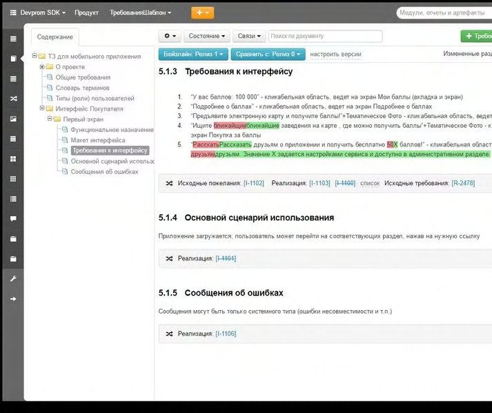

*Типичный интерфейс современных систем управления требованиями, ориентированных преимущественно на хранение и согласование требований.*

## Как работает AutoProm AI

AutoProm AI — это платформа, которая соединяет традиционное управление требованиями с возможностями современных ИИ-моделей. Она ориентирована на высокорегламентированные отрасли, где важны traceability, соответствие стандартам и скорость внесения изменений.

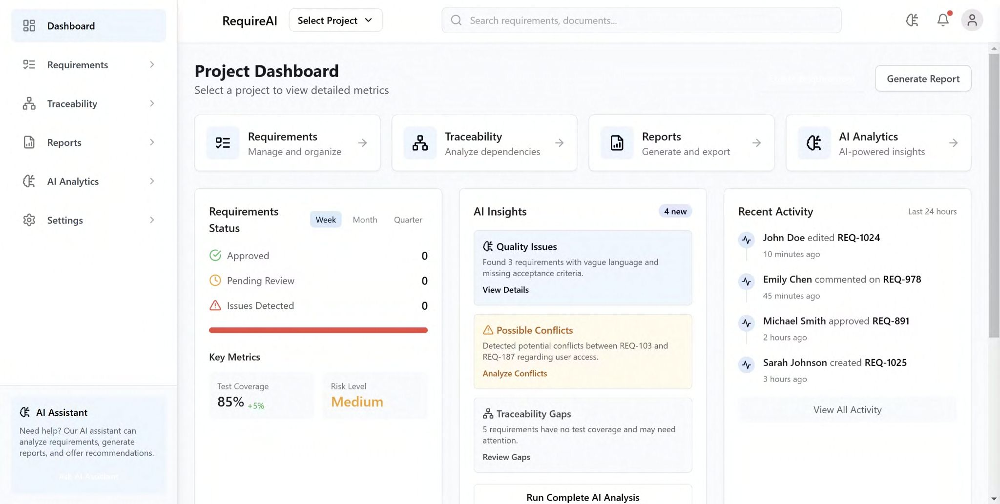

*Единое рабочее пространство для управления требованиями, анализа зависимостей и взаимодействия с ИИ.*

Основные возможности:

- **Автоматизированный контроль качества** — ИИ ускоряет проверку требований и снижает количество ошибок.
- **Обнаружение дубликатов и несоответствий** — автоматический поиск конфликтующих требований.
- **Анализ системных зависимостей** — выявление связей между требованиями и компонентами.
- **Оценка рисков и прогнозирование воздействия** — анализ влияния изменений.
- **Ускоренная сертификация** — сокращение объёма ручной работы при подготовке документации.

## Ключевые возможности

### Структура требований и трассируемость

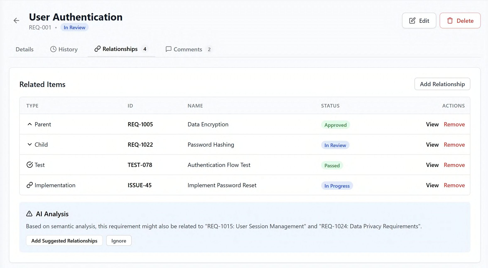

*Иерархия требований и автоматическое отслеживание связей между элементами системы.*

### Работа с требованиями

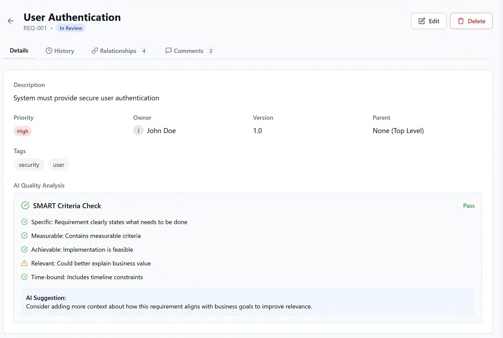

*Карточка требования с анализом качества, связей, рисков и рекомендациями по улучшению.*

### Мгновенная сверка требований с шаблонами и регламентами

Платформа сравнивает требования с корпоративными шаблонами или внешними нормативными документами. ИИ проверяет смысловое соответствие за секунды вместо нескольких дней ручного ревью.

### Выявление зависимостей и рисков изменений

Ни один специалист не в состоянии постоянно держать в голове тысячи требований. AutoProm AI анализирует весь массив данных и сразу показывает потенциальные проблемы при внесении изменений.

### ИИ-ассистент

Это языковая модель, обученная на данных конкретной компании — use cases, спецификациях, исторических требованиях и регламентах. Ассистент помогает решать типовые задачи: проверять качество требований, генерировать черновики и искать связи между документами.

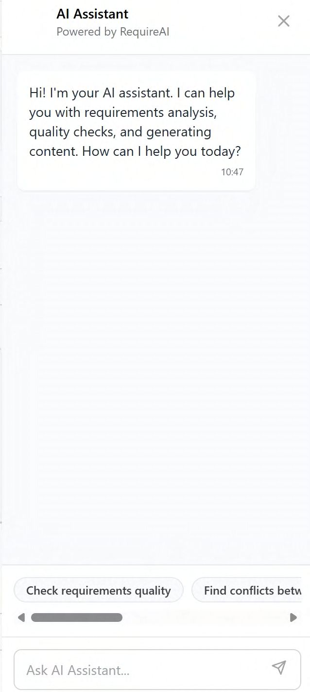

*Корпоративный ИИ-ассистент для анализа требований и работы с внутренней базой знаний.*

## Пример работы

Допустим, один стейкхолдер требует реализовать двухфакторную аутентификацию для всех пользователей. Второй — сделать вход в систему в один клик без лишних шагов.

Платформа автоматически обнаруживает конфликт требований, оценивает последствия и предлагает возможные варианты решения.

*Автоматическое обнаружение противоречий между требованиями и рекомендации по их устранению.*

### Демонстрация платформы

*Основные сценарии работы AutoProm AI: создание требований, анализ качества, поиск конфликтов, работа с зависимостями и взаимодействие с ИИ-ассистентом.*

## Экономический эффект

Для проекта с бюджетом 200 млн рублей средняя доля переделок составляет около 30% (60 млн рублей). Из них примерно 70% связаны с ошибками в требованиях — это 42 млн рублей.

При стоимости использования AutoProm AI около 7 млн рублей в год на проект возврат инвестиций составляет примерно 600%.

По отдельным исследованиям (в частности, данным Porsche), использование ИИ в подобных процессах позволяет существенно сократить объём повторных работ и ускорить процессы согласования требований.

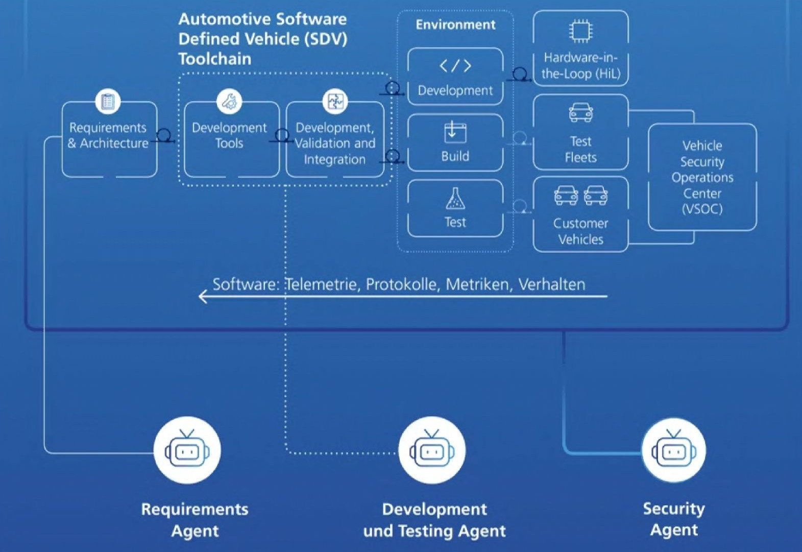

*Подходы к использованию искусственного интеллекта в инженерных процессах и управлении требованиями.*

## Риски

Основные риски — качество работы моделей ИИ, вопросы безопасности данных, сложности интеграции с существующими системами и возможный перерасход бюджета на внедрение.

Эти риски учитываются при проектировании: платформа поддерживает on-premise-развертывание, имеет механизмы human-in-the-loop и готовые интеграции с Jira, GitLab, Siemens PLM и другими системами.

## Итог

Цифровая трансформация заставляет промышленные компании пересматривать инструменты управления требованиями. AutoProm AI — это решение, которое учитывает как жёсткие регуляторные требования, так и новые реалии software-defined разработки с частыми изменениями и OTA-обновлениями.

Платформа позволяет находить проблемы на ранних этапах, сокращать время ревью и снижать стоимость ошибок в проектах, где цена каждой из них измеряется миллионами рублей.
